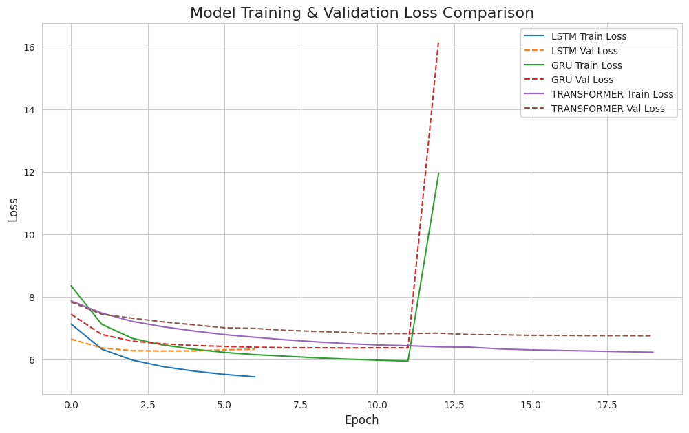
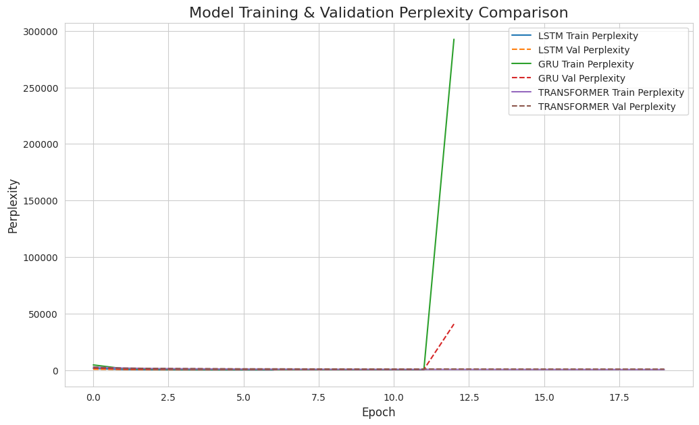
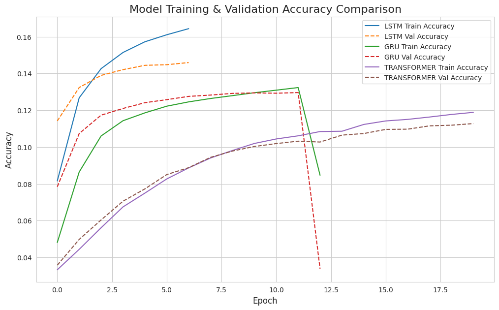
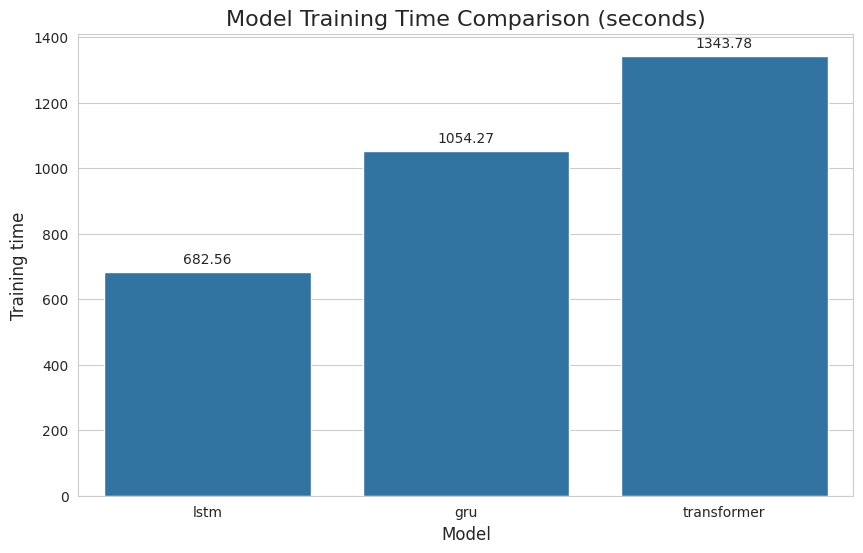

# Text Synthesis Comparison using RNNs and Transformer

> An end-to-end, multi-GPU accelerated pipeline for training, tuning, and evaluating advanced NLP models (LSTM, GRU, Transformer) using TensorFlow 2 and Keras.

This repository provides a production-grade framework for tackling complex text generation tasks. It moves beyond simple scripts to a fully abstracted, modular, and high-performance system. The architecture is designed to eliminate common bottlenecks in deep learning workflows, such as data ingestion and single-GPU limitations, enabling rapid experimentation and robust model training.

[](https://www.python.org/downloads/release/python-390/) [](https://www.tensorflow.org/) [](https://opensource.org/licenses/MIT)

---

## Core Philosophy: Engineered for Speed and Scale

This project was built to solve two critical challenges in deep learning:

1.  **The Data Bottleneck:** Low GPU utilization during training is often caused by the CPU's inability to preprocess and feed data fast enough. This framework solves this with a highly optimized **`tf.data.Dataset`** pipeline, using `.cache()` and `.prefetch()` to ensure the GPU is always saturated with data.
2.  **The Single-GPU Limitation:** Training large models on massive datasets can take days. This framework is architected for **Data Parallelism** using TensorFlow's **`tf.distribute.MirroredStrategy`**. It seamlessly distributes the training load across all available GPUs on a machine, drastically reducing training and hyperparameter tuning times.

The entire system is abstracted into distinct, reusable modules, making the main notebook (`Text_Synthesis_Comparison.ipynb`) a clean, high-level interface for orchestration and analysis.

---

## Key Features

-   **Fully Abstracted & Modular Architecture:** Code is meticulously organized by function (`data_pipeline`, `model_architectures`, `training_assets`) for maximum clarity, maintainability, and reusability.
-   **Seamless Multi-GPU Distributed Training:** Natively supports training and hyperparameter tuning across multiple GPUs with `MirroredStrategy`, requiring minimal configuration changes.
-   **Optimized, Bottleneck-Free Data Ingestion:** Leverages the `tf.data.Dataset` API to create an asynchronous, high-throughput pipeline that prevents GPU starvation.
-   **Automated Hyperparameter Tuning:** Integrates **Keras Tuner** to automatically find the best hyperparameters (learning rate, embedding dimensions, etc.) for each model architecture in a distributed fashion.
-   **Advanced Subword Tokenization:** Employs a custom-trained **Byte-Pair Encoding (BPE)** tokenizer from the Hugging Face `tokenizers` library to efficiently handle large vocabularies and unknown words.
-   **Comprehensive Evaluation:** Goes beyond simple accuracy by implementing a custom **Perplexity** metric, providing a more nuanced assessment of language model performance.
-   **JIT Compilation Ready:** The Transformer model is configured to support `jit_compile=True` for an additional performance boost via XLA (Accelerated Linear Algebra).
-   **Centralized Control:** A single `CONFIG` dictionary in the main notebook acts as the control panel for the entire project, making it trivial to change datasets, model parameters, and training settings.

---

## The Central `CONFIG` Control Panel

Experimentation is managed through a single, easy-to-use dictionary in `Text_Synthesis_Comparison.ipynb`. This allows you to modify core parameters without ever touching the underlying modules.

```python
# The central configuration dictionary in the main notebook
strategy = tf.distribute.MirroredStrategy()
per_replica_batch_size = 256
global_batch_size = per_replica_batch_size * strategy.num_replicas_in_sync

CONFIG = {
    "data_file": "data_pipeline/abcnews-date-text.csv",
    "sample_size": 500000,
    "tokenizer_path": "data_pipeline/bpe-tokenizer.json",
    "vocab_size": 15000,
    "max_len": 50,
    "batch_size": global_batch_size,
    "final_training_epochs": 40,
    "models_to_run": ['lstm', 'gru', 'transformer']
}
```

---

## Performance at a Glance

Visualizations of a comparative training run between LSTM and GRU models.

<table>
  <tr>
    <td align="center"><strong>Training & Validation Loss</strong></td>
    <td align="center"><strong>Training & Validation Perplexity</strong></td>
  </tr>
  <tr>
    <td></td>
    <td></td>
  </tr>
  <tr>
    <td align="center"><strong>Training & Validation Accuracy</strong></td>
    <td align="center"><strong>Comparative Training Time</strong></td>
  </tr>
  <tr>
    <td></td>
    <td></td>
  </tr>
</table>

---

## How to Run the Project

### 1. Prerequisites
-   Python 3.9+
-   An NVIDIA GPU is highly recommended. For multi-GPU training, a machine with multiple CUDA-enabled NVIDIA GPUs is required.
-   NVIDIA CUDA Toolkit & cuDNN installed and configured for TensorFlow.

### 2. Setup
```bash
# Clone the repository
git clone https://github.com/Vishisht16/Text-Synthesis-Comparison
cd Text-Synthesis-Comparison

# Create and activate a Python virtual environment
python -m venv .venv
source .venv/bin/activate  # On Windows: .venv\Scripts\activate

# Install all required dependencies
pip install -r requirements.txt
```

### 3. Execution
1.  **Launch the Jupyter Environment:**
    ```bash
    jupyter notebook
    ```
2.  **Run the Main Notebook:**
    -   Open `Text_Synthesis_Comparison.ipynb`.
    -   Verify that the kernel is using your virtual environment (`.venv`).
    -   Execute the cells sequentially from top to bottom.

The notebook is designed to be run as a whole. It will automatically detect your GPU configuration, run the entire data and training pipelines, save all assets (plots, models), and display the final results.

---

## Architectural Deep-Dive

The project's power lies in its meticulously organized structure.

```
.
├── Text_Synthesis_Comparison.ipynb # The high-level control notebook.
│
├───data_pipeline/                  # === The Foundation ===
│   ├── dataset_loader.py           # Loads and cleans the raw CSV data.
│   ├── tokenizer.py                # Trains and loads the BPE tokenizer.
│   └── data_preparation.py         # Constructs the high-performance tf.data pipeline.
│
├───training_assets/                # === The Engine ===
│   ├── tuner.py                    # Multi-GPU hyperparameter tuning logic.
│   └── trainer.py                  # Multi-GPU final model training logic.
│
├───model_architectures/            # === The Brains ===
│   ├── lstm_model.py               # Defines the tunable LSTM architecture.
│   ├── gru_model.py                # Defines the tunable GRU architecture.
│   └── transformer_model.py        # Defines the tunable Transformer architecture.
│
├───evaluation/                     # === The Analysis ===
│   ├── metrics.py                  # Defines the custom Perplexity metric.
│   └── plotter.py                  # Generates all comparison plots.
│
├───plots/                          # Output directory for saved visualizations.
├───trained_models/                 # Output directory for the best trained model weights.
└───tuning_results/                 # Directory for Keras Tuner logs and checkpoints.
```

---

## License

This project is licensed under the MIT License. See the `LICENSE` file for more details.